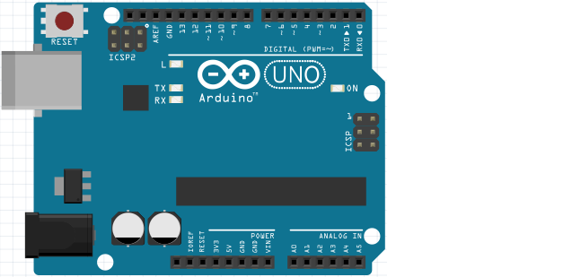

# Les 1: Blink

In deze les gaan we de allergemakkelijkste schakeling maken die er is: Blink!

 | We beginnen makkelijk!
:-------------:|:----------------------------------------: 

## 1.1 Blink: een Arduino aansluiten

Sluit een Arduino zo aan:



Doe een USB kabel in je Arduino en in je laptop.

## 1.2 Blink: opdracht 1

Sluit de Arduino aan.

 | De Arduino heeft zelf al een lampje dat je kunt programmeren.
:-------------:|:----------------------------------------: 

\pagebreak

## 1.3 Blink: de Arduino IDE opstarten

 | We programmeren de Arduino met de Arduino IDE
:-------------:|:----------------------------------------: 

 | 'IDE' spreek je uit als 'ie-dee-ee'
:-------------:|:----------------------------------------: 

Start de Arduino IDE door:

 * Klik op de snelkoppeling op het Bureaublad
 * Druk op de Windows toets (linksonder, tussen `Ctrl` en `Alt`). Type 
   dan `arduino` (kleine letters) en dan Enter


\pagebreak

Je ziet nu je de Arduino IDE:


 | IDE betekent 'Integrated Development Environment', het programma waarmee je programmeert.
:-------------:|:----------------------------------------: 

\pagebreak

## 1.4 Blink: ons eerste programma

Dit is (een versie van) de code van `Blink`:

```c++
void setup() 
{
  pinMode(13, OUTPUT);
}

void loop() 
{
  digitalWrite(13, HIGH);
  delay(1000);
  digitalWrite(13, LOW);
  delay(1000);
}
```

 | 
:-------------:|:----------------------------------------: 
`void setup() { }`|'Lieve computer, doe wat tussen accolades staat een keer.'

 | 
:-------------:|:----------------------------------------: 
`void loop() { }`|'Lieve computer, doe de hele tijd wat tussen accolades staat.'

Type de code over in de Arduino IDE en klik op `Upload`.


## 1.5 Blink: opdracht 2

Laat het LEDje 10x zo snel knipperen. 
Hint: het LEDje is nu 1000 milliseconden aan en 1000 milliseconden uit.

\pagebreak

## 1.6 Blink: oplossing 2

```c++
void setup()
{
  // ...
}

void loop() 
{
  digitalWrite(13, HIGH);
  delay(100);
  digitalWrite(13, LOW);
  delay(100);
}
```

| `// ...` betekent 'De code die je daar al hebt staan'
:-------------:|:----------------------------------------: 

 | 
:-------------:|:----------------------------------------: 
`pinMode(13, OUTPUT);`|'Zorg dat er spanning uit pin 13 kan komen'

 | 
:-------------:|:----------------------------------------: 
`digitalWrite(13, HIGH);`|'Zet spanning op pin 13'

 | 
:-------------:|:----------------------------------------: 
`delay(1000);`|'Wacht 1000 milliseconden'

## 1.7 Blink: opdracht 3

Laat het LEDje zo snel als kan knipperen. Wat zie je?

\pagebreak

## 1.8 Blink: oplossing 3

Er zijn meer oplossingen, dit is er een:

```c++
void setup()
{
  // ...
}

void loop() 
{
  digitalWrite(13, HIGH);
  delay(1);
  digitalWrite(13, LOW);
  delay(1);
}
```

Je ziet het lampje niet meer knipperen. 

 | Je ziet het lampje niet meer knipperen!
:-------------:|:----------------------------------------: 


 | Het lampje knippert wel, maar onze ogen kunnen niet snel genoeg kijken om het te zien.
:-------------:|:----------------------------------------: 

 | 
:-------------:|:----------------------------------------: 
`digitalWrite(13, LOW);`|'Haal de spanning van pin 13 af'

 | Ook goed: `delay(0);` of de regels met `delay` helemaal weghalen.
:-------------:|:----------------------------------------: 


\pagebreak

## 1.9 Blink: LED aansluiten

Nu is het tijd Blink aan te sluiten:


 * Haal het USB snoer uit de computer, zodat de Arduino geen spanning meer heeft
 * Sluit Blink aan zoals op de tekening
 * Zet de spanning weer op de Arduino
 * Als het goed is, knippert het rode LEDje nu mee met het LEDje op de Arduino. 

 | Als het LEDje niet brandt, draai deze dan om.
:-------------:|:----------------------------------------: 

## 1.10 Blink: opdracht 4

Sluit je LEDje nu aan op pin 12.

 | Het is cool om na pin 13 pin 12 te pakken
:-------------:|:----------------------------------------: 

 | Dit is ook omdat pinnen 0 en 1 speciaal zijn
:-------------:|:----------------------------------------: 

\pagebreak

## 1.11 Blink: oplossing 4


## 1.12 Blink: opdracht 5

Zorg nu dat het LEDje op pin 12 gaat knipperen op de seconde.

 | LED is een afkorting voor 'Light Emitting Diode'
:-------------:|:----------------------------------------: 

 | Goed gezegd! Beter te laat dan nooit!
:-------------:|:----------------------------------------: 

 | LED is in het Nederlands: 'Diode waar licht uit komt'
:-------------:|:----------------------------------------: 

\pagebreak

## 1.13 Blink: oplossing 5

```c++
void setup() 
{
  pinMode(12, OUTPUT);
}

void loop() 
{
  digitalWrite(12, HIGH);
  delay(100);
  digitalWrite(12, LOW);
  delay(100);
}
```

## 1.14 Blink: eindopdracht

Sluit de LED aan op pin 11 en laat deze 2 keer per seconde knipperen.

 | Gelukt? Laat dit zien aan een volwassene voor een paraaf!
:-------------:|:----------------------------------------: 
