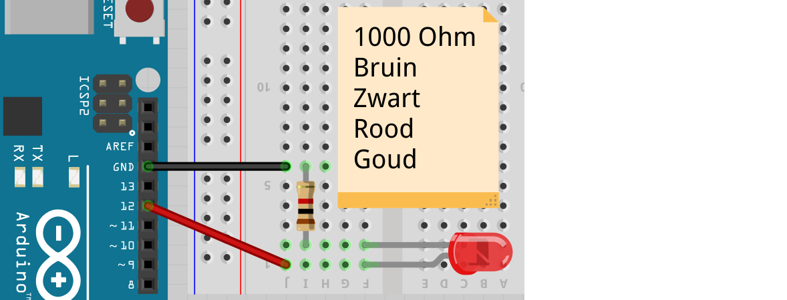

# Les 2: Blink Blink Blink

Deze les heet 'Blink Blink Blink', omdat het de les Blink is, maar dan met drie lampjes.

## 2.1: Blink Blink Blink: Blink 


Dit is de code van Blink op een andere manier:

```c++
const int pin_led = 13;

void setup() 
{
  pinMode(pin_led, OUTPUT);
}

void loop() 
{
  digitalWrite(pin_led, HIGH);
  delay(1000);
  digitalWrite(pin_led, LOW);
  delay(1000);
}
```

`pin_led` wordt een variabele genoemd: een stukje computergeheugen met een naam.

 | 
:-----------------------:|:----------------------------------------: 
`const int pin_led = 13;`|'Lieve computer, onthoud een heel getal met de naam `pin_led` met beginwaarde 13.'

## 2.2: Blink Blink Blink: Opdracht 1

Sluit de LED aan op pin 12 en verander de code zodat deze gaat knipperen.

\pagebreak

## 2.3: Blink Blink Blink: Oplossing 1



Je hoeft maar een regel te veranderen:

```c++
const int pin_led = 12;

void setup() 
{
  // ...
}

void loop() 
{
  // ...
}
```

## 2.4: Blink Blink Blink: Opdracht 2

Maak zelf een nieuwe variabele met de naam `wachttijd`. 
`wachttijd` is een heel getal met beginwaarde 1000.
Gebruik `wachttijd` in de regels met `delay`.

 | Slim! Als je `wachttijd` leest, weet je waar het voor is. Bij `1000` weet je dat niet
:-------------:|:----------------------------------------: 

\pagebreak

## 2.5: Blink Blink Blink: Oplossing 2

```c++
// ... [maak pin_led met waarde 12]
const int wachttijd = 1000;

void setup() 
{
  // ...
}

void loop() 
{
  // ... [zet spanning op pin_led]
  delay(wachttijd);
  // ... [geen spanning op pin_led af]
  delay(wachttijd);
}
```

| `// ... [wat]` betekent 'De code die je daar al hebt staan die gaat over wat er tussen blokhaken staat'
:-------------:|:----------------------------------------: 

## 2.6: Blink Blink Blink: Blink Blink Blink aansluiten

Nu is het tijd 'Blink Blink Blink' aan te sluiten:


 * Haal het USB snoer uit de computer, zodat de Arduino geen spanning meer heeft
 * Sluit de onderdelen aan zoals op de tekening

## 2.7: Blink Blink Blink: Opdracht 3

Sluit 'Blink Blink Blink' aan. Hernoem de variable `pin_led` naar `pin_led_1`
en zorg dat 'ie de juiste beginwaarde heeft.

\pagebreak

## Oplossing 3

```c++
const int pin_led_1 = 11;
// ... [onthoud wachttijd]

void setup() 
{
  pinMode(pin_led_1, OUTPUT);
}

void loop() 
{
  digitalWrite(pin_led_1, HIGH);
  // [wacht wachttijd milliseconden]
  digitalWrite(pin_led_1, LOW);
  // [wacht wachttijd milliseconden]
}
```

 | Programmeurs gebruiken veel variabelen, omdat de code dan beter te snappen is.
:-------------:|:----------------------------------------: 

## 2.8: Blink Blink Blink: Opdracht 4

Maak een nieuwe variable `pin_led_2`. 
Laat dan eerst het eerste LEDje aan en uit gaan, laat dan het tweede LEDje aan en uit gaan.

 | De schrijfwijze `pin_led_2` wordt 'snake case' genoemd: 'snake' is Engels voor slang
:-------------:|:----------------------------------------: 

 | Zou je schijven `pinLed2`, dan wordt dat 'camel case' genoemd: 'camel' is Engels voor kameel
:-------------:|:----------------------------------------: 

 | Mij maakt het niet uit welke je kiest
:-------------:|:----------------------------------------: 

\pagebreak

## 2.9: Blink Blink Blink: Oplossing 4

```c++
const int pin_led_1 = 11;
const int pin_led_2 = 10;
// ...

void setup() 
{
  pinMode(pin_led_1, OUTPUT);
  pinMode(pin_led_2, OUTPUT);
}

void loop() 
{
  digitalWrite(pin_led_1, HIGH);
  // ... [wacht wachttijd milliseconden]
  digitalWrite(pin_led_1, LOW);
  // ... [wacht wachttijd milliseconden]
  digitalWrite(pin_led_2, HIGH);
  // ... [wacht wachttijd milliseconden]
  digitalWrite(pin_led_2, LOW);
  // ... [wacht wachttijd milliseconden]
}
```

## 2.10: Blink Blink Blink: Opdracht 5

Maak een derde variabele `pin_led_3`. Laat nu steeds alle lampjes tegelijk knipperen: allemaal aan, dan allemaal uit.

 | Dit is best veel typewerk! Later leer je hoe dit slimmer kan
:-------------:|:----------------------------------------: 

 | Klopt! Met arrays kun je meerdere getallen in een variabele opslaan
:-------------:|:----------------------------------------: 

\pagebreak

## 2.11: Blink Blink Blink: Oplossing 5

```c++
// ... [maak wachttijd, pin_led_1 en pin_led_2]
const int pin_led_3 = 9;

void setup() 
{
  // ... [pin_led_1 en pin_led_2 geven spanning]
  pinMode(pin_led_3, OUTPUT);
}

void loop() 
{
  // ... [zet spanning op LED 1 en 2]
  digitalWrite(pin_led_3, HIGH);
  // ... [wacht wachttijd milliseconden]
  // ... [zet spanning op LED 1 en 2]
  digitalWrite(pin_led_3, LOW);
  // ... [wacht wachttijd milliseconden]
}
```

## 2.12: Blink Blink Blink: Eindopdracht

Laat de lampjes nu in een 'Knight Rider patroon' gaan: 1-2-3-2. Er moet altijd precies een lampje branden.

 | Knight Rider was een TV serie met een pratende auto.
:-------------:|:----------------------------------------: 


