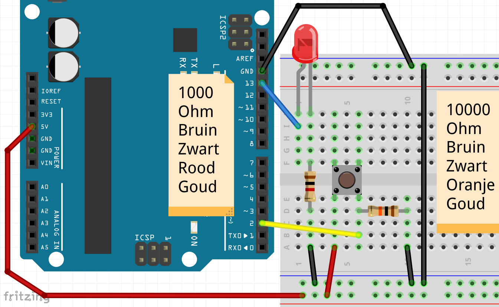
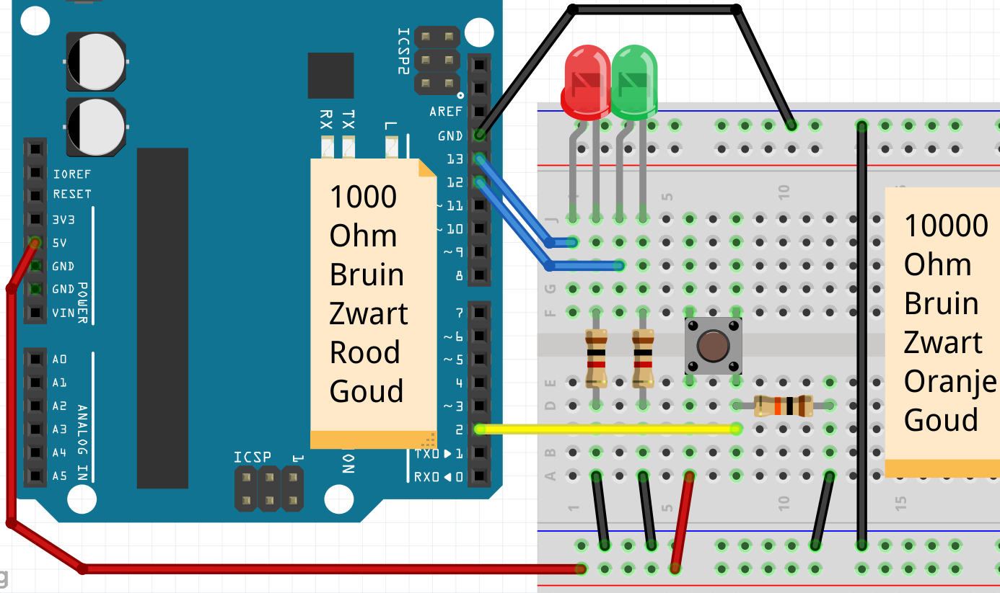
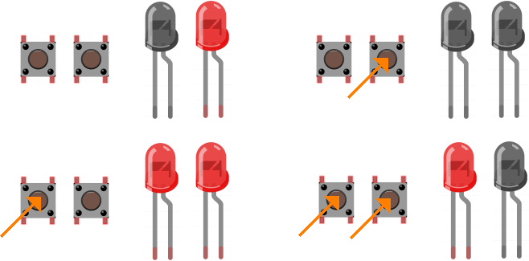

# Les 3: Knop if ... else

In deze les laten we de Arduino vragen aan zichzelf stellen.

 | De Arduino wordt dus een soort filosoof!
:-------------:|:----------------------------------------: 

## 3.1. Knop if ... else: Aansluiten



 | De weerstand aan de knop wordt een 'Pull Down' weerstand genoemd
:-------------:|:----------------------------------------: 

\pagebreak

## 3.2. Knop if ... else: Code

Hier is code om het lampje aan te laten gaan,
als de knop wordt ingedrukt:

```c++
const int pin_led = 13;
const int pin_knop = 2;

void setup() 
{
  pinMode(pin_led, OUTPUT);
  pinMode(pin_knop, INPUT);
}

void loop()
{
  digitalWrite(pin_led, digitalRead(pin_knop));
}
```

                | 
:--------------------------------------------:|:----------------------------------------: 
`digitalRead(pin_knop)`                       |'Geef mij HIGH als er op `pin_knop` spanning staat. Geef anders LOW'
`digitalWrite(pin_led, digitalRead(pin_knop))`|'Zet op `pin_led` spanning als er op `pin_knop` spanning staat'

 | De 'Pull Down' weerstand zorgt dat pin 2 verbonden is met GND als de knop niet ingedrukt is
:-------------:|:----------------------------------------: 

## 3.3. Knop if ... else: Vragen

Als je de knop indrukt, gaat de LED dan uit of aan?

\pagebreak

## 3.4. Knop if ... else: Antwoorden

De LED gaat dan aan

 | De LED gaat dan aan
:-------------:|:----------------------------------------: 

## 3.5. Knop if ... else: `if`

Met `if` kun je de Arduino iets laten doen, als iets zo is:

```c++
if (digitalRead(pin_knop) == HIGH)
{
  digitalWrite(pin_led_rood, HIGH);
}
else
{
  digitalWrite(pin_led_groen, LOW);
}
```

In deze code wordt gekeken of op `pin_knop` spanning staat. 
Zo ja, dan zet de Arduino
spanning op `pin_led_rood`. 
Anders (`else`) haalt de Arduino de spanning van `pin_led_groen` af.

  | 
:------------------------------:|:----------------------------------------: 
`if (digitalRead(pin_knop) == HIGH) {}`|'Lieve computer, als er spanning op `pin_knop` staat, doe dan dat tussen accolades'

 | De `=` kun je uitspreken als 'zet op'. De `==` kun je uitspreken als 'is gelijk aan'
:-------------:|:----------------------------------------: 

\pagebreak

## 3.6. Knop if ... else: Opdracht 1

Dit is voorbeeld code, die niet helemaal af is:

```c++
void setup() 
{
  pinMode(4, INPUT );
  pinMode(5, OUTPUT);
  pinMode(6, OUTPUT);
}

void loop()
{
  if (digitalRead(4) == HIGH)
  {
    digitalWrite(5, HIGH);
  }
  else
  {
    digitalWrite(6, LOW);
  }
}
```

Maak de code af, zodat:

 * als je op de knop drukt, het lampje aan gaat 
 * als je op de knop niet indrukt, het lampje uit gaat
 * gebruik variabelen om de pinnen een naam te geven

 | Na de ronde haken van `if` komt geen puntkomma
:-------------:|:----------------------------------------: 

\pagebreak

## 3.7. Knop if ... else: Oplossing 1

```c++
// ...

void setup() 
{
  // ...
}

void loop()
{
  if (digitalRead(pin_knop) == HIGH)
  {
    digitalWrite(pin_led, HIGH);
  }
  else
  {
    digitalWrite(pin_led, LOW);
  }
}
```

| `// ...` betekent 'De code die je daar al hebt staan'
:-------------:|:----------------------------------------: 

## 3.8. Knop if ... else: Opdracht 2

Sluit een tweede, groen LEDje aan. Maak de code zo, dat:

 * als je op de knop drukt, dat het eerste lampje aan gaat en het tweede LEDje uit 
 * als je op de knop niet indrukt, dat het eerste lampje uit gaat en het tweede LEDje uit
 * Noem de variabele voor de pin van de rode LED `pin_led_rood`, voor de
   groene LED `pin_led_groen`

| Binnen de accolades van een `if` kun je meerdere regels typen. Net als tussen de accolades van `setup` en `loop`!
:-------------:|:----------------------------------------: 

 | Vergeet de `else` ('doe anders') niet!
:-------------:|:----------------------------------------: 

\pagebreak

## 3.9. Knop if ... else: Oplossing 2

Figuur `Oplossing van 'Knop met twee LEDjes'` laat zien hoe je dit aan moet sluiten.



Dit is de code:

```c++
const int pin_led_rood = 13;
const int pin_led_groen = 12;
// ...

void setup() 
{
  pinMode(pin_led_rood, OUTPUT);
  pinMode(pin_led_groen, OUTPUT);
  // ...
}

void loop()
{
  if (/* ... */)
  {
    digitalWrite(pin_led_groen, LOW);
    digitalWrite(pin_led_rood, HIGH);
  }
  else
  {
    digitalWrite(pin_led_groen, HIGH);
    digitalWrite(pin_led_rood, LOW);
  }
  delay(10);
}
```

\pagebreak

| `/* ... */` betekent ook 'De code die je daar al hebt staan'
:-------------:|:----------------------------------------: 

## 3.10. Knop if ... else: Eindopdracht

Sluit een tweede knop aan. Maak de code zo, dat

 * als je op de eerste knop drukt, dat het eerste lampje aan gaat
 * als je de eerste knop niet indrukt, dat het eerste lampje uit gaat
 * als je op de tweede knop drukt, dat het tweede lampje uit gaat
 * als je de tweede knop niet indrukt, dat het tweede lampje aan gaat

| Je kunt vaker `if` na elkaar zetten
:-------------:|:----------------------------------------: 

 | Voor een tweede knop heb je een tweede weerstand van tienduizend Ohm nodig
:-------------:|:----------------------------------------: 


