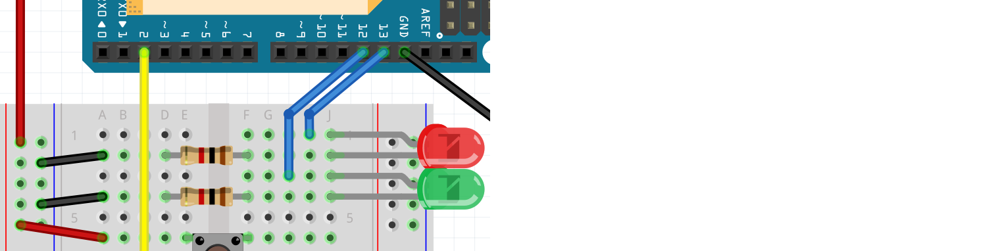

# Les 4: Knop flip

In deze les leren we een variabele te gebruiken.

 | De les heet 'knop flip' omdat je met een flip-flop programmeert 
:-------------:|:----------------------------------------: 

## 4.1. Knop flip: Intro

We beginnen met deze schakeling:


 | Hee, deze schakeling herken ik!
:-------------:|:----------------------------------------: 

\pagebreak

En we gebruiken deze code:

```c++
const int pin_led = 13;
const int pin_knop = 2;

void setup() 
{
  pinMode(pin_led, OUTPUT);
  pinMode(pin_knop, INPUT);
}

void loop()
{
  if (digitalRead(pin_knop) == HIGH)
  {
    digitalWrite(pin_led, HIGH);
  }
  else
  {
    digitalWrite(pin_led, LOW);
  }
}
```

 | Hee, deze code herken ik!
:-------------:|:----------------------------------------: 

## 4.2. Knop flip: Knop eeuwig aan: opdracht 1

Zet bovenaan de code, boven `setup`:

```c++
boolean is_aan = false;
```

In het begin van `loop`, gebruik een `if` om te kijken of de knop is
ingedrukt. Zo ja, zet `is_aan` op `true`:

```c++
if (/* de knop is ingedrukt */)
{
  is_aan = true;
}
``` 

Na de eerste `if` in `loop`, gebruik een `if` om te kijken of `is_aan`
gelijk is aan `true`. Zo ja, zet zet de LED aan. Zo nee, zet de LED uit.

```c++
if (is_aan == true)
{
  //Zet de LED aan
}
else
{
  //Zet de LED uit
}
```

Wat zie je?

\pagebreak

## 4.3. Knop flip: Knop eeuwig aan: oplossing 2


```c++
// ...
boolean is_aan = false;

// ...

void loop()
{
  if (digitalRead(pin_knop) == HIGH)
  {
    is_aan = true;
  }

  if (is_aan == true)
  {
    digitalWrite(pin_led, HIGH);
  }
  else
  {
    digitalWrite(pin_led, LOW);
  }
}
```

Als je op de knop drukt, blijft de LED eeuwig aan.

## 4.4. Knop flip: Knop eeuwig aan: opdracht 2

We gaan nu zeggen:
  
 * Als je de knop indrukt, gaat de LED aan en blijft aan
 * Als je de knop dan weer indrukt, gaat de LED uit en blijft uit
 * Als je de knop dan weer indrukt, gaat de LED aan en blijft aan
 * Enzovoorts

Pas de `if` aan die kijkt of de knop is ingedrukt:

```c++
if (digitalRead(pin_knop) == HIGH)
{
  if (is_aan == true)
  {
    is_aan = false;
  }
  else
  {
    is_aan = true;
  }
}
```

Upload de code. Wat zie je? Als je iets raars ziet, klopt dat!

 | Wat zie je?| | Als je iets raars ziet, klopt dat!
:-------------:|:----------------:|:-------------:|:----------------------------------------: 


\pagebreak

## 4.5. Knop flip: Knop eeuwig aan: oplossing 2

```c++
// ...

void loop()
{
  if (digitalRead(pin_knop) == HIGH)
  {
    if (is_aan == true)
    {
      is_aan = false;
    }
    else
    {
      is_aan = true;
    }
  }

  // ...

}
```

 | Als je de knop indrukt, dimt het LEDje. Laat je de knop los, dan blijft het LEDje of eeuwig aan of eeuwig uit
:-------------:|:----------------------------------------: 

 | Dit komt omdat de Arduino snel en vaak het lampje aan en uit zet
:-------------:|:----------------------------------------: 

## 4.6. Knop flip: Knop eeuwig aan met fijne besturing: opdracht 2

We gaan ervoor zorgen dat de knop beter reageert:
als de knop ingedrukt wordt, laat de Arduino dan
200 milliseconden wachten.

\pagebreak

## 4.7. Knop flip: Knop eeuwig aan met fijne besturing: oplossing 2

In de `if` van als de knop wordt ingedrukt, voeg
een `delay(200);` regel toe. Dit kan voor of na de `if` statements
met `is_aan`.

```c++
// ...

void loop()
{
  if (digitalRead(pin_knop) == HIGH)
  {
    // ... [if (is_aan == true) ...]

    delay(200);

    // ... [if (is_aan == true) ...]
  }

  // ...

}
```

## 4.8. Knop flip: twee LEDs besturen: opdracht

We gaan een tweede LED aansluiten. Door de knop in te drukken, kun je wisselen
tussen leds.

 * Sluit een tweede, groene LED aan op pin 12
 * In de code, verander bovenaan:

```c++
// pin_led gaat weg
const int pin_led_rood = /* pin nummer */;
const int pin_led_groen = /* pin nummer */;
// ... [pin_knop blijft hetzelfde]
// is_aan gaat weg
int welke_led_aan = 1;
```

 * In de code, in `setup`, zorg dat de twee LEDs en de knop worden gevonden.
 * In de code, in `loop`, reageer anders op de knop:

```c++
if (/* de knop is ingedrukt */)
{
  welke_led_aan = welke_led_aan + 1;
  if (welke_led_aan == 3)
  {
    welke_led_aan = 1;
  }

  // ... [wacht 200 milliseconden]
}
```

 * In de code, in `loop`, reageer nu op `welke_led_aan`:

```c++
if (welke_led_aan == 1)
{
  // Zet rode LED aan, zet groene LED uit
}
if (welke_led_aan == 2)
{
  // Zet rode LED uit, zet groene LED aan
}
```

\pagebreak

## 4.9. Knop flip: twee LEDs besturen: oplossing




```c++
const int pin_led_rood = 13;
const int pin_led_groen = 12;
const int pin_knop = 2;
int welke_led_aan = 1;

void setup() 
{
  pinMode(pin_led_rood, OUTPUT);
  pinMode(pin_led_groen, OUTPUT);
  pinMode(pin_knop, INPUT);
}

void loop()
{
  if (/* de knop is ingedrukt */)
  {
    welke_led_aan = welke_led_aan + 1;
    if (welke_led_aan == 3)
    {
      welke_led_aan = 1;
    }

    // ... [wacht 200 milliseconden]
  }
  
  if (welke_led_aan == 1)
  {
    digitalWrite(pin_led_rood, HIGH);
    digitalWrite(pin_led_groen, LOW);
  }
  if (welke_led_aan == 2)
  {
    digitalWrite(pin_led_rood, LOW);
    digitalWrite(pin_led_groen, HIGH);
  }
}
```

## 4.10. Knop flip: eindopdracht

We gaan een derde LED aansluiten. Door de knop in te drukken, kun je wisselen
van eerste, naar tweede, naar derde LED.

