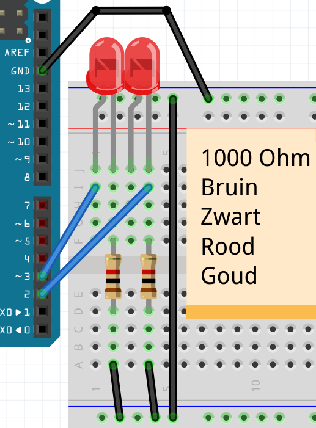

# Les 5: Blink 4

In deze les gebruiken we 4 LEDs en functies

## 5.1 Blink 6: Opdracht

 * Maak een schakeling met 2 LEDs, elk met een weerstand van 1000 Ohm in serie
 * Sluit de 1e LED aan op pin 2
 * Sluit de 2e LED aan op pin 3
 * Upload deze code:

```c++
const int pin_led_1 = 2;
const int pin_led_2 = 3;
const int wachttijd = 1000;

void setup()
{
  pinMode(pin_led_1, OUTPUT);
  pinMode(pin_led_2, OUTPUT);
}

void loop()
{
  digitalWrite(pin_led_1, HIGH);
  digitalWrite(pin_led_2, LOW);
  delay(wachttijd);
  digitalWrite(pin_led_1, LOW);
  digitalWrite(pin_led_2, HIGH);
  delay(wachttijd);
}
```

## 5.2 Blink 6: Oplossing



## 5.3 Blink 6: `effe_wachten`, opdracht

We gaan onze eerste functie schrijven!

 * Voeg aan je code toe, boven `loop`:

```c++
void effe_wachten()
{
  delay(wachttijd);
}
```

 * In `loop`, vervang twee keer `delay(wachttijd);` door `effe_wachten();`

## 5.4 Blink 6: `effe_wachten`, oplossing

```c++
// ...

void setup()
{
  // ...
}

void effe_wachten()
{
  delay(wachttijd);
}

void loop()
{
  // ... [zet alleen LED 1 aan]
  effe_wachten();
  // ... [zet alleen LED 2 aan]
  effe_wachten();
}
```

## 5.5 Blink 6: `zet_alleen_led_1_aan`, opdracht

 * Schrijf een functie, `zet_alleen_led_1_aan`,
   die ervoor zorgt dat alleen LED 1 brandt (oftewel:
   LED 2 moet uit)
 * Gebruik `zet_alleen_led_1_aan` in `loop`

## 5.6 Blink 6: `zet_alleen_led_1_aan`, oplossing

```c++
void zet_alleen_led_1_aan()
{
  digitalWrite(pin_led_1, HIGH);
  digitalWrite(pin_led_2, LOW);
}

void loop()
{
  zet_alleen_led_1_aan();
  // ...
}
```

## 5.7 Blink 6: `zet_alleen_led_2_aan`, opdracht

 * Schrijf een functie, `zet_alleen_led_2_aan`,
   die ervoor zorgt dat alleen LED 2 brandt (oftewel:
   LED 1 moet uit)
 * Gebruik `zet_alleen_led_2_aan` in `loop`

## 5.8 Blink 6: `zet_alleen_led_2_aan`, oplossing

```c++
void zet_alleen_led_2_aan()
{
  digitalWrite(pin_led_1, LOW);
  digitalWrite(pin_led_2, HIGH);
}

void loop()
{
  // ...
  zet_alleen_led_2_aan();
}
```

## 5.7 Blink 6: `zet_alleen_led_3_aan`, opdracht

 * Sluit een derde LEDje aan, op pin 4
 * Maak een nieuwe variabele `pin_led_3` voor deze LED
 * Schrijf een functie, `zet_alleen_led_3_aan`,
   die ervoor zorgt dat alleen LED 3 brandt (oftewel:
   LEDs 1 en 2 moeten uit)
 * Gebruik `zet_alleen_led_3_aan` in `loop`
 * In `loop`, laat eerst alleen LED 1 branden, wacht effe, 
   laat eerst alleen LED 2 branden, wacht effe, 
   laat eerst alleen LED 3 branden, wacht effe


## 5.8 Blink 6: `zet_alleen_led_3_aan`, oplossing

```c++
// ...
const int pin_led_3 = 4;

void setup()
{
  // ...
  pinMode(pin_led_3, OUTPUT);
}

void zet_alleen_led_1_aan()
{
  // ...
  digitalWrite(pin_led_3, LOW);
}

void zet_alleen_led_2_aan()
{
  // ...
  digitalWrite(pin_led_3, LOW);
}

void zet_alleen_led_3_aan()
{
  digitalWrite(pin_led_1, LOW);
  digitalWrite(pin_led_2, LOW);
  digitalWrite(pin_led_3, HIGH);
}

void loop()
{
  // ...
  zet_alleen_led_3_aan();
  effe_wachten();
}
```

## 5.9 Blink 6: eindopdracht

 * Sluit een vierde LEDje aan, op pin 5
 * Maak een nieuwe variabele `pin_led_4` voor deze LED
 * Schrijf een functie, `zet_alleen_led_4_aan`,
   die ervoor zorgt dat alleen LED 4 brandt (oftewel:
   LEDs 1 en 2 en 3 moeten uit)
 * Gebruik `zet_alleen_led_4_aan` in `loop`
 * In `loop`, maak een Nightrider patroon: laat omstebeurt branden
   LEDs 1, 2, 3, 4, 3, 2, 1. Steeds ertussen even wachten


