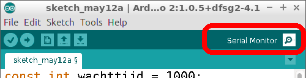
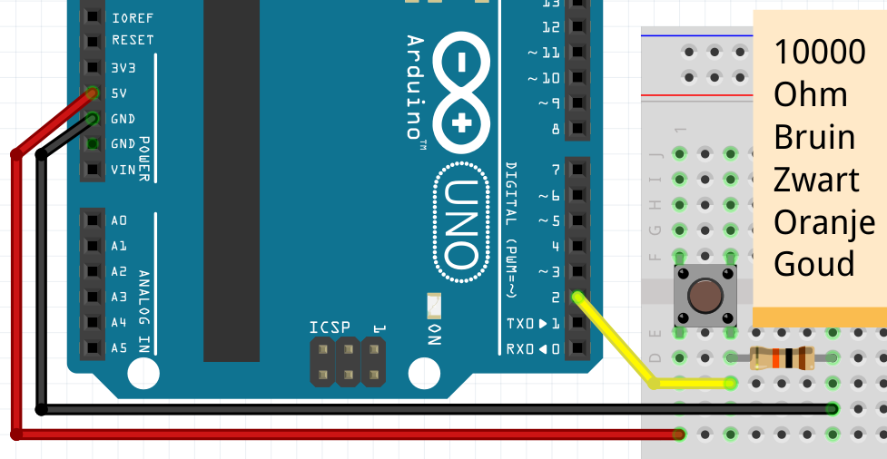

# Les 6: Knop kiest

In deze les gebruiken we een knop, LEDs en een functie die een waarde teruggeeft.

## 6.1 Knop kiest: Hoi, opdracht

 * Je hoeft niks aan te sluiten!
 * Upload deze code:

```c++
const int wachttijd = 1000;

void setup()
{
  Serial.begin(9600);
}

void loop()
{
  Serial.println("Hoi");
  delay(wachttijd);
}
```
 * Na het uploaden, klik op 'Serial Monitor'



Wat zie je?

## 6.2 Knop kiest: Hoi, oplossing

Je ziet dat de Arduino 'Hoi' zegt!


## 6.3 Knop kiest: `wacht_effe` en `laat_zien`, opdracht

 * Schrijf een functie `wacht_effe`: in deze functie wacht de Arduino 
   `wachttijd` milliseconden
 * Schrijf een functie `laat_zien`: in deze functie zegt de Arduino 'Hoi'
 * Gebruik `laat_zien` en dan `wacht_effe` in `loop` 

## 6.4 Knop kiest: `wacht_effe` en `laat_zien`, oplossing

```c++
// ...

void setup()
{
  // ...
}

void laat_zien()
{
  Serial.println("Hoi");
}

void wacht_effe()
{
  delay(wachttijd);
}

void loop()
{
  laat_zien();
  wacht_effe();
}
```


## 6.5 Knop kiest: knop, opdracht

 * Sluit een knop aan op pin 2
 * Maak een variabele `pin_knop`
 * Vervang `laat_zien` door deze code: 

```c++
void laat_zien()
{
  if (digitalRead(pin_knop) == HIGH)
  {
    Serial.println("Knop is ingedrukt");
  }
}
```

## 6.6 Knop kiest: knop, oplossing



```c++
// ...
const int pin_knop = 2;

void setup()
{
  // ...
  pinMode(pin_knop, INPUT);
}

void setup()
{
  // ...
}

void laat_zien()
{
  if (digitalRead(pin_knop) == HIGH)
  {
    Serial.println("Knop is ingedrukt");
  }
}

void loop()
{
  // ...
}
```

## 6.7 Knop kiest: knop, opdracht

 * In `laat_zien`, als de knop niet is ingedrukt, laat de
   Arduino dan 'Knop is niet ingedrukt' zeggen
 * Verander `wachttijd` naar 100 milliseconden

## 6.8 Knop kiest: knop, oplossing

```c++
const int wachttijd = 100;
// ... [variabele pin_knop]

// ...

void laat_zien()
{
  if (/* de knop is ingedrukt */)
  {
    // ... [zeg dat de knop is ingedrukt]
  }
  else
  {
    Serial.println("Knop is niet ingedrukt");
  }
}
```

## 6.9 Knop kiest: knop, opdracht

 * Maak een variabele `aantal`. Dit is een heel getal dat kan veranderen
   met beginwaarde nul
 * 