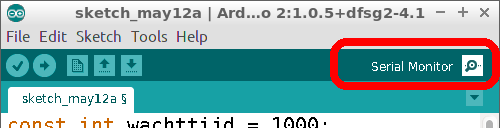
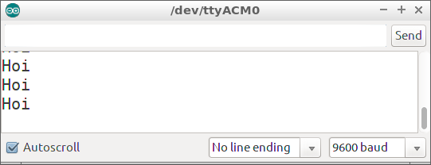
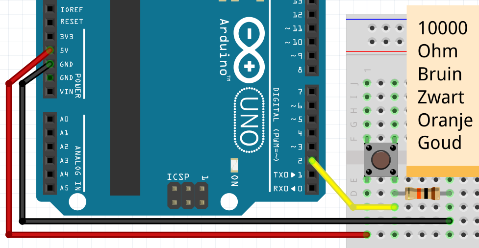

# Les 6: Oplaadknop

In deze les gebruiken we een knop, LEDs en een functie die een waarde teruggeeft.

## 6.1 Oplaadknop: Hoi, opdracht

 * Je hoeft niks aan te sluiten!
 * Upload deze code:

```c++
const int wachttijd = 1000;

void setup()
{
  Serial.begin(9600);
}

void loop()
{
  Serial.println("Hoi");
  delay(wachttijd);
}
```
 * Na het uploaden, klik op 'Serial Monitor'



Wat zie je?

## 6.2 Oplaadknop: Hoi, oplossing

Je ziet dat de Arduino 'Hoi' zegt!



## 6.3 Oplaadknop: `wacht_effe` en `laat_knop_zien`, opdracht

 * Schrijf een functie `wacht_effe`: in deze functie wacht de Arduino 
   `wachttijd` milliseconden
 * Schrijf een functie `laat_knop_zien`: in deze functie zegt de 
   Arduino (nu nog) 'Hoi'
 * Gebruik `laat_knop_zien` en dan `wacht_effe` in `loop` 

## 6.4 Oplaadknop: `wacht_effe` en `laat_knop_zien`, oplossing

```c++
// ...

void setup()
{
  // ...
}

void laat_knop_zien()
{
  Serial.println("Hoi");
}


void wacht_effe()
{
  delay(wachttijd);
}

void loop()
{
  laat_knop_zien();
  wacht_effe();
}
```


## 6.5 Oplaadknop: knop, opdracht

 * Sluit een knop aan op pin 2
 * Maak een variabele `pin_knop`
 * In `setup`, zeg met `pinMode` dat `pin_knop` een `INPUT` is
 * Vervang `laat_knop_zien` door deze code: 

```c++
void laat_knop_zien()
{
  if (digitalRead(pin_knop) == HIGH)
  {
    Serial.println("Knop is ingedrukt");
  }
}
```

## 6.6 Oplaadknop: knop, oplossing



```c++
// ...
const int pin_knop = 2;

void setup()
{
  // ...
  pinMode(pin_knop, INPUT);
}

void setup()
{
  // ...
}

void laat_knop_zien()
{
  if (digitalRead(pin_knop) == HIGH)
  {
    Serial.println("Knop is ingedrukt");
  }
}

void loop()
{
  // ...
}
```

## 6.7 Oplaadknop: knop los, opdracht

 * In `laat_knop_zien`, als de knop niet is ingedrukt, laat de
   Arduino dan 'Knop is niet ingedrukt' zeggen
 * Verander `wachttijd` naar 100 milliseconden

## 6.8 Oplaadknop: knop los, oplossing

```c++
const int wachttijd = 100;
// ... [variabele pin_knop]

// ...

void laat_knop_zien()
{
  if (/* de knop is ingedrukt */)
  {
    // ... [zeg dat de knop is ingedrukt]
  }
  else
  {
    Serial.println("Knop is niet ingedrukt");
  }
}
```

## 6.9 Oplaadknop: `aantal,` opdracht

 * Maak een variabele `aantal`. Dit is een heel getal dat kan veranderen,
   met beginwaarde nul
 * Maak een nieuwe functie, `laat_aantal_zien`. In deze functie wordt
   de waarde van `aantal` naar de seriele monitor gestuurd. 
   Dit programmeer je met:

```
Serial.println(aantal);
```

 * Gebruik `laat_knop_zien`, dan `laat_aantal_zien` en dan `wacht_effe` in `loop` 

## 6.10 Oplaadknop: `aantal`, oplossing

```c++
// ...
int aantal = 0;

void laat_aantal_zien()
{
  Serial.println(aantal);
}

void loop()
{
  // ...
  laat_aantal_zien();
  // ...
}
```

## 6.11 Oplaadknop: `reageer_op_knop`, opdracht

 * Maak een nieuwe functie, `reageer_op_knop`. 
   In `reageer_op_knop`: als de knop is ingedrukt, 
   wordt `aantal` 1 meer. Dit programmeer je met:

```
aantal = aantal + 1;
```

 * Gebruik `reageer_op_knop` tussen `laat_knop_zien` en `laat_aantal_zien` 
   in `loop` 


## 6.12 Oplossing

```c++
void reageer_op_knop()
{
  if (digitalRead(pin_knop) == HIGH)
  {
    aantal = aantal + 1;
  }
}

void loop()
{
  // ...
  reageer_op_knop();
  // ...
}
```

## 6.13: Eindopdracht

 * In `reageer_op_knop`: als de knop is losgelated, wordt `aantal` weer nul
 * Sluit een LED aan op pin 13
 * De LED brandt alleen als `aantal` meer is dan tien. Gebruik dit `if` statement:

```c++
if (aantal > 10)
{
  // ...
}
```
