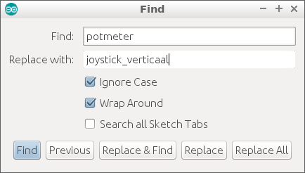

# Les 7: Potmeter en joystick

In deze les gebruiken we een potmeter, een joystick en een functie die een waarde teruggeeft.

## 7.1 Potmeter: aansluiten, opdracht

 * Sluit een potmeter aan. Leg de volgende verbindingen:

Potmeter         | Arduino
-----------------|--------
Linker pootje    | 5V
Middelste pootje | A0
Rechter pootje   | GND

## 7.2 Potmeter: aansluiten, oplossing

[schema hier]

## 7.3 Potmeter: opstarten, opdracht

 * In `setup`, start de seriele monitor op 9600 baud
 * Maak een variabele `wachttijd` met een waarde van 100
 * Maak een functie `effe_wachten` die het programma `wachttijd` milliseconde
   laat wachten
 * Maak een functie `laat_potmeter_zien`, die het woord `potmeter` naar de
   seriele monitor stuurt
 * In `loop`, gebruik `laat_potmeter_zien` en `effe_wachten`

## 7.4 Potmeter: opstarten, oplossing

```c++
const int wachttijd = 100; //milliseconden

void setup() 
{
  Serial.begin(9600);
}

void laat_potmeter_zien()
{
  Serial.print("potmeter");
}

void effe_wachten()
{
  delay(wachttijd);  
}

void loop() 
{
  laat_potmeter_zien();
  effe_wachten();
}
```

## 7.5 Potmeter: lezen, opdracht

 * Maak een variabele `pin_potmeter` met als waarde `A0`.
 * In `setup`, zet de `pinMode` van `pin_potmeter` op `INPUT`
 * Voeg deze functie toe:

```
int lees_potmeter()
{
  return analogRead(pin_potmeter);
}
```

 * In `laat_potmeter_zien` vervang de tekst `"potmeter"` door `lees_potmeter()`
 * Upload het programma en draai aan de potmeter. Welke getallen komen uit?

## 7.6 Potmeter: lezen, oplossing

```
const int pin_potmeter = A0;
//...

void setup() 
{
  // ...
  pinMode(pin_potmeter, INPUT);
}

int lees_potmeter()
{
  return analogRead(pin_potmeter);
}

void laat_potmeter_zien()
{
  Serial.print(lees_potmeter());
}
```

De getallen die uit `lees_potmeter` komen zitten tussen nul en 1024 in. 

## 7.7 Potmeter: sturen, opdracht

 * Sluit een LED aan op pin 11
 * Maak een variabele `pin_led` met de juiste waarde
 * In `setup`, zet de `pinMode` van `pin_led` op `OUTPUT`
 * In `laat_potmeter_zien` voeg deze regel toe:

```c++
analogWrite(pin_led, lees_potmeter());
```

 * Upload en draai aan de potmeter. Wat zie je?

## 7.8 Potmeter: sturen, oplossing

```c++
// ...
const int pin_led = 11;

void setup() 
{
  // ...
  pinMode(pin_led, OUTPUT);
}

void laat_potmeter_zien()
{
  // ...
  analogWrite(pin_led, lees_potmeter());
}
```

Als je aan de potmeter draait, zie je dat het LEDje vier keer vloeiend
aan gaat.


## 7.9 Potmeter: goed sturen, opdracht

 * Verander de volgende code ...
 
```c++
analogWrite(pin_led, lees_potmeter());
```

... naar dit:

```c++
analogWrite(pin_led, lees_potmeter() / 4);
```

 * Wat zie je?
 * Wat denk je dat `/` betekent? Tip: waar zie je dit soort strepen 
   bij rekenen?


## 7.10 Potmeter: goed sturen, oplossing

 * Je ziet dat het LEDje nu mooi van uit naar aan gaat als je aan de 
   potmeter draait
 * De `/` betekent 'gedeeld door'. Dit is dezelfde deelstreep als bij
   breuken en procenten!

## 7.11 Potmeter: joystick aansluiten, opdracht

 * Vervang de potmeter door een joystick. Leg de volgende verbindingen:

Joystick | Arduino
---------|--------
VCC      | 5V
V        | A0
H        | A1
GND      | GND

 * Als je dit goed hebt aangesloten, kun je met de joystick nu het LEDje besturen

## 7.11 Potmeter: joystick aansluiten, oplossing

[stroomschema]

## 7.12 Potmeter: joystick lezen, opdracht

In de code, vervang de tekst `potmeter` door `joystick_verticaal`
Gebruik hiervoor 'Find' (CTRL-F of `Edit | Find`) en gebruik 'Replace 
All' ('Vervang alles').



## 7.12 Potmeter: joystick lezen, oplossing

```c++
const int pin_joystick_verticaal = A0;
// ...

void setup() 
{
  pinMode(pin_joystick_verticaal, INPUT);
  // ...
}

int lees_joystick_verticaal()
{
  return analogRead(pin_joystick_verticaal);
}

void laat_joystick_verticaal_zien()
{
  Serial.print(lees_joystick_verticaal());
  analogWrite(pin_led, lees_joystick_verticaal() / 4);
}

void loop() 
{
  laat_joystick_verticaal_zien();
  // ...
}
```

## 7.12 Potmeter: eindopdracht

 * Sluit een tweede LEDje aan
 * Dit tweede LEDje moet reageren zoals het eerste LEDje, maar dan als
   de joystick horizontaal wordt bewogen


