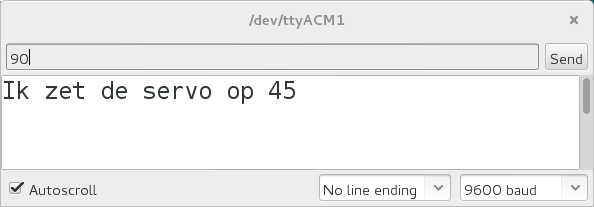

# 13. Servo met seriele monitor

Een servo is een motortje die je in een bepaalde hoek kunt zetten.

 | Servo's worden veel gebruikt in robots
:-------------:|:----------------------------------------: 

## Aansluiten

Op het plaatje zie je hoe je een servo aansluit:


 | De meeste servo's kunnen niet rond
:-------------:|:----------------------------------------: 

\pagebreak

## Code

Gebruik deze code:

```c++
#include <Servo.h>

Servo mijn_servo;

void setup()
{
  Serial.begin(9600);
  mijn_servo.attach(9);
}

void loop()
{
  if (Serial.available())
  {
    const int getal = Serial.parseInt();
    Serial.print("Ik zet de servo op ");
    Serial.println(getal);
    mijn_servo.write(getal);
    delay(1000);
  }
}
```

 | 
:---------------------------:|:-------------------------------------------------: 
`Servo mijn_servo;`          |'Lieve computer, onthoud een Servo met de naam `mijn_servo`'.
`mijn_servo.attach(9);`      |'Lieve computer, `mijn_servo` zit aan pin 9'.
`if (Serial.available()) {}` |'Lieve computer, is er iets in de seriele monitor ingetypt? Zo ja, doe dan dat tussen accolades'.
`Serial.parseInt()`          |'Lieve computer, lees het getal (niet het woord) dat is ingetypt'.
`const int getal`            |'Lieve computer, onthoud een heel getal met de naam `getal`, dat alleen maar mag worden gelezen'
`mijn_servo.write(getal);`   |'Lieve computer, zet de servo op een hoek van `getal` graden'.

\pagebreak

## Getallen naar de Arduino sturen

Als je de code op de Arduino hebben gezet, kun je via de `Serial Monitor`
getallen naar de Arduino sturen. Dit kun je zien op het plaatje



 | Op deze manier kun jij tegen de Arduino praten
:-------------:|:----------------------------------------: 

## Opdracht 1

  1. Bepaal het laagste en hoogste getal van een servo motor. 
  2. Bereken het verschil tussen het laagste en hoogste getal

\pagebreak

## Oplossing 1

  1. Ha, dit mag je zelf uitvinden :-)
  2. Dit zit ergens tussen 80-150 graden, afhankelijk van je servo motor

## Eindopdracht

Stuur een servo motor perfect aan met de seriele monitor. 
Gebruik hiervoor de minimum en maximum waarde die je hebt gevonden bij jouw servo motor.


