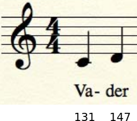
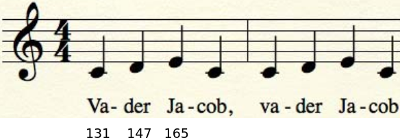

# Les 17: Simpele Melodie

In deze les gaan we een simpele melodie maken, namelijk Vader Jacob!


\pagebreak

## Les 17: Simpele Melodie: Opdracht 1

Sluit figuur 'Aansluiten van een speaker' aan.


Zet deze code op je Arduino:

```c++
const int speaker_pin = 8;

void setup()
{
  tone(speaker_pin, 131, 250); // Va
  delay(300);
}

void loop()
{

}
```

Wat hoor je?

\pagebreak

## Les 17: Simpele Melodie: Oplossing 1

Je hoort de eerste noot van Vader Jacob!

In figuur 'De eerste noot van Vader Jacob' zie je de eerste noot als bladmuziek.
Onder de noot staat de tekst, daaronder de toonhoogte in Hertz.


 | 131 Hertz is de toonhoogte van de noot C.
:-------------:|:----------------------------------------: 

 | 
:-------------:|:----------------------------------------: 
`tone(..., 131, ...);`| (zingt) do!

\pagebreak

## Les 17: Simpele Melodie: Opdracht 2

De eerste noot van Vader Jacob heeft een toonhoogte van 131 Hertz.
De tweede noot van Vader Jacob heeft een toonhoogte van 147 Hertz.
Programmeer de eerste twee noten van Vader Jacob.




\pagebreak

## Les 17: Simpele Melodie: Oplossing 2

```c++
const int speaker_pin = 8;

void setup()
{
  tone(speaker_pin, 131, 250); // Va
  delay(300);
  tone(speaker_pin, 147, 250); // der
  delay(300);
}

void loop()
{

}
```

 | 147 Hertz is de toonhoogte van de noot D.
:-------------:|:----------------------------------------: 

 | 
:-------------:|:----------------------------------------: 
`tone(..., 147, ...);`| (zingt) re!

\pagebreak

## Les 17: Simpele Melodie: Opdracht 3

De derde noot van Vader Jacob heeft een toonhoogte van 165 Hertz.
Programmeer de eerste drie noten van Vader Jacob.


\pagebreak

## Les 17: Simpele Melodie: Oplossing 3

```c++
const int speaker_pin = 8;

void setup()
{
  tone(speaker_pin, 131, 250); // Va
  delay(300);
  tone(speaker_pin, 147, 250); // der
  delay(300);
  tone(speaker_pin, 165, 250); // Ja
  delay(300);
}

void loop()
{

}
```

 | 165 Hertz is de toonhoogte van de noot E.
:-------------:|:----------------------------------------: 

 | 
:-------------:|:----------------------------------------: 
`tone(..., 165, ...);`| (zingt) mi!

\pagebreak

## Les 17: Simpele Melodie: Opdracht 4

De vierde noot van Vader Jacob heeft dezelfde toonhoogte als de eerste.
Programmeer de vierde noot van Vader Jacob.


\pagebreak

## Oplossing 4

```c++
const int speaker_pin = 8;

void setup()
{
  tone(speaker_pin, 131, 250); // Va
  delay(300);
  tone(speaker_pin, 147, 250); // der
  delay(300);
  tone(speaker_pin, 165, 250); // Ja
  delay(300);
  tone(speaker_pin, 131, 250); // cob
  delay(300);
}

void loop()
{

}
```

 | 
:-------------:|:----------------------------------------: 
`tone(..., 147, ...);`| (zingt) re!

\pagebreak

## Les 17: Simpele Melodie: Opdracht 5

De vijfde, zesde, zevende en achtste noot zijn dezelfde als de eerste vier. Programmeer dit.




\pagebreak

## Les 17: Simpele Melodie: Oplossing 5

```c++
const int speaker_pin = 8;

void setup()
{
  tone(speaker_pin, 131, 250); // Va
  delay(300);
  tone(speaker_pin, 147, 250); // der
  delay(300);
  tone(speaker_pin, 165, 250); // Ja
  delay(300);
  tone(speaker_pin, 131, 250); // cob
  delay(300);
  tone(speaker_pin, 131, 250); // Va
  delay(300);
  tone(speaker_pin, 147, 250); // der
  delay(300);
  tone(speaker_pin, 165, 250); // Ja
  delay(300);
  tone(speaker_pin, 131, 250); // cob
  delay(300);
}

void loop()
{

}
```

 | Je mag de herhaling ook in een `for` loop zetten!
:-------------:|:----------------------------------------: 

 | 
:-------------:|:----------------------------------------: 
`for (int i = 0; i < 2; ++i) { ... }`| 'Doe wat tussen accolades staat twee keer'

\pagebreak

## Les 17: Simpele Melodie: Opdracht 6

Nu komt twee keer 'Slaapt gij nog'. 'Slaapt' dezelfde hoogte als 'Ja', 'gij' is 175 Hertz, 'nog' is 196 Hertz.
Tot nu toe duurden alle noten 250 milliseconden.
De derde noot, 'nog' moet 500 milliseconden duren.


\pagebreak

## Les 17: Simpele Melodie: Oplossing 6

In de code staat nu `//...`. Dit betekent dat daar de oude code moet blijven staan.

```c++
const int speaker_pin = 8;

void setup()
{
  //...
  tone(speaker_pin, 165, 250); // Slaapt
  delay(300);
  tone(speaker_pin, 175, 250); // gij
  delay(300);
  tone(speaker_pin, 196, 500); // nog
  delay(500);
  tone(speaker_pin, 165, 250); // Slaapt
  delay(300);
  tone(speaker_pin, 175, 250); // gij
  delay(300);
  tone(speaker_pin, 196, 500); // nog
  delay(500);
}

void loop()
{

}
```

 | Je mag de herhaling ook in een `for` loop zetten!
:-------------:|:----------------------------------------: 

\pagebreak

## Les 17: Simpele Melodie: Opdracht 7

Nu komt twee keer 'Alle klokken luiden'. 
In de figuur 'Alle klokken luiden' staan de toonhoogten.
De noten die aan elkaar vastzitten ('Alle klokken') duren elk 125 milliseconden.


\pagebreak

## Les 17: Simpele Melodie: Oplossing 7

```c++
const int speaker_pin = 8;

void setup()
{
  //...
  tone(speaker_pin, 131, 125); // Al
  delay(125);
  tone(speaker_pin, 147, 125); // le
  delay(125);
  tone(speaker_pin, 165, 125); // klok
  delay(125);
  tone(speaker_pin, 131, 125); // ken
  delay(125);
  tone(speaker_pin, 131, 250); // lui
  delay(300);
  tone(speaker_pin, 147, 250); // den
  delay(300);
}

void loop()
{

}
```

 | (zingt) Vader Jacob, Vader Jacob! (maar niet erg goed)
:-------------:|:----------------------------------------: 

\pagebreak

## Les 17: Simpele Melodie: Eindopdracht

Maak het liedje Vader Jacob af. Zie figuur 'Vader Jacob bladmuziek' hoe de laatste noten moeten.


