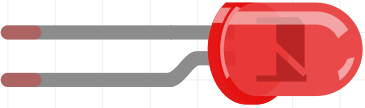
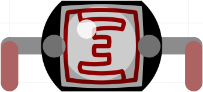
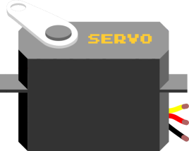
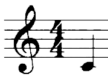
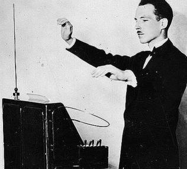
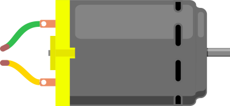

# Hoofdstukken

De losse hoofdstukken van de boeken.

## 1. LED en knop

 * [Les 1: Blink](01_blink/README.md)
 * [Les 2: Blink Blink Blink](02_blink_blink_blink/README.md)
 * [Les 3: Knop if else](03_knop_if_else/README.md) + Serial 
 * [Les 4: Knop flip](04_knop_flip/README.md)

## 2. LEDs

 * [Les 5: Blink 4](05_blink_4/README.md) 
 * [Les 6: Oplaadknop](06_oplaadknop/README.md)
 * [Les 7: Potmeter en joystick](07_potmeter_en_joystick/README.md)
 * [Les 8: LDR kiest LED](08_ldr_kiest/README.md)

## 3. RGB LEDs

 * [Les 9: RGB LED](09_rgb/README.md)
 * [Les 10: Potmeter RGB](10_potmeter_rgb/README.md)
 * [Les 11: FSR RGB](11_fsr_rgb/README.md) 
 * [Les 12: LDR RGB](12_ldr_rgb/README.md) 

## 4. Actuator, laag vermogen

 * [Les 13: Servo met seriele monitor](13_servo_serial/README.md)
 * [Les 14: Servo met potmeter](14_servo_potmeter/README.md)
 * [Les 15: FSR met servo](15_servo_fsr/README.md)
 * [Les 16: Servo's](16_servos/README.md)

## 5. Muziek

 * [Les 17: simpele melodie](17_simpele_melodie/README.md)
 * [Les 18: 7-pin-piano](18_7_pin_piano/README.md)
 * [Les 19: 1-pin-7-parallelle_weerstanden-piano](19_1_pin_7_parallelle_weerstanden_piano/README.md)
 * [Les 20: 1-pin-7-weerstanden-in-serie-piano](20_1_pin_7_weerstanden_in_serie_piano/README.md)

### 6. Theremin

 * [Les 21: Theremin met potmeters](21_theremin_potmeters/README.md)
 * [Les 22: Theremin met LDR](22_theremin_ldr/README.md)
 * [Les 23: Theremin met infrarode afstandssensor](23_theremin_infrarood/README.md)
 * [Les 24: Theremin met joystick](24_theremin_joystick/README.md)

### 7. Capacitieve sensoren

 * [Les 25: Capacitieve sensor 1: een](CapacitieveSensor1/README.md)
 * [Les 26: Capacitieve sensor 2: twee losse](CapacitieveSensor2/README.md)
 * [Les 27: Capacitieve sensor 3: twee gekoppelde](CapacitieveSensor3/README.md)
 * Les 28: Capacitieve sensor 4: drie gekoppelde voor Arduino Invaders

### 8. Leesbare output

 * [Les 29: Zeven segmenten display](ZevenSegmentDisplay/README.md)
 * [Les 30: LCD 1](LCD1/README.md)
 * [Les 31: LCD 2](LCD2/README.md)
 * [Les 32: LCD 3](LCD3/README.md)

### 9. Hi-tech

 * [Les 33: RFID 1](RFID1/README.md)
 * [Les 34: RFID 2](RFID2/README.md)
 * [Les 35: ArduinoISP](ArduinoISP/README.md): bootloader branden met de Arduino als ISP
 * [Les 36: Bare-bone Arduino](BareBoneArduino/README.md): de Arduino zonder printplaat

### 10. Veel output

 * Les 37: Schuifregister 1: een schuif register
 * Les 38: Schuifregister 2: twee schuif registers
 * [Les 39: NeoPixels 1: blink op een LEDje](NeoPixel1/README.md)
 * [Les 40: NeoPixels 2: ?regenboog op alle LEDjes](NeoPixel2/README.md)

### Actuator, hoger vermogen

 * [DC motor met transistor](dc_motor_met_transistor/README.md)
 * [DC motor met relais](dc_motor_met_relais/README.md)
 * [Obstakel ontwijkend object](obstakel_ontwijkend_object/README.md)

## Dingen

 * Alcohol sensor
 * [Arduino en Processing](Arduino_en_processing/README.md)
 * [Breadboard](breadboard/README.md)
 * [Blink snelheid](BlinkSnelheid/README.md)
 * [Chatroom](chatroom/README.md)
 * Druksensor
 * Kleurensensor
 * Laser
 * Nokia5110
 * Pulsgever
 * Reedcontact
 * Stappenmotor
 * [tone](tone/README.md)
 * Ultrasone afstandssensor

## Lesvormen

 * [Stroomdeeltje spelen 1](StroomdeeltjeSpelen1/README.md)
 * Stroomdeeltje spelen 2: weerstanden in parallel en serie
 * Stroomdeeltje spelen 3: spanningsdeler
 * For loop spelen
 * Binair tellen

## Leskaarten

 * [Leskaart 1](leskaarten/leskaart_1.pdf)

## Andere plekken

 * [YouTube kanaal: BasOnTech](https://www.youtube.com/c/BasOnTechNL)
